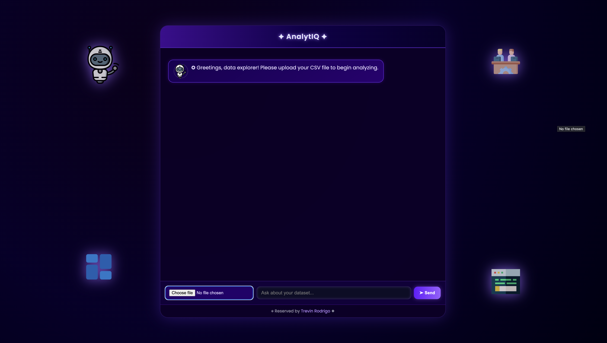
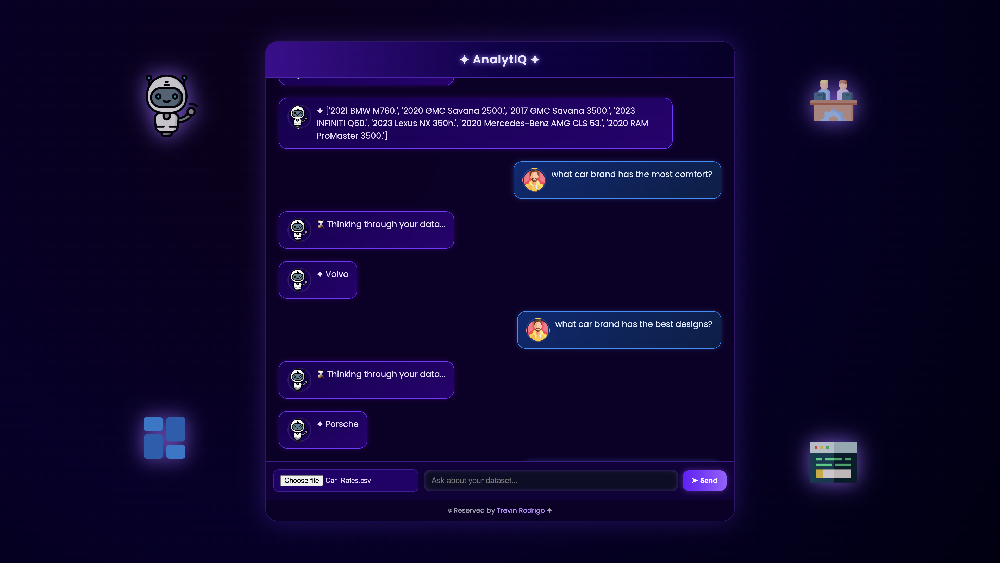
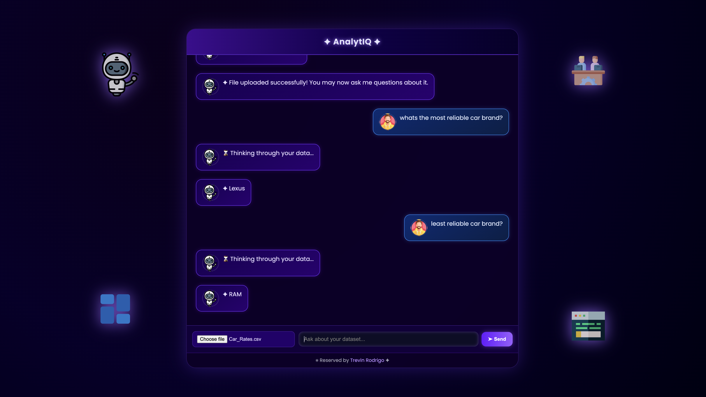

# 🚀 AI CSV Agent — Gemini-Powered CSV Data Explorer  

## 🧠 About This Project
**AI CSV Agent** is a **Flask-based web app** that lets you upload a CSV file and chat with your data in plain English.  
It uses **Google’s Gemini API** to generate valid **Pandas expressions** that answer your questions — no coding needed.  

💬 **Example:**  
> **Q:** What is the average age of employees?  
> **A:** The AI writes and executes `df["age"].mean()` and displays the result instantly.

---

## 🖼️ Screenshots  
<div align="center">
  
  <br><br>
  
  <br><br>
  
</div>

---

## ⚙️ Features
- 🔹 Upload your own CSV file securely  
- 🔹 Ask natural language questions  
- 🔹 Auto-generates and runs Pandas code  
- 🔹 Displays the AI’s executed code and result  
- 🔹 Built with **Flask**, **Pandas**, and **Gemini API**

---

## 🛠️ How to Run Locally  

### 1️⃣ Clone this repository
```bash
git clone https://github.com/YOUR_USERNAME/AI_CSV_Agent.git
cd AI_CSV_Agent
```

### 2️⃣ Install dependencies
```bash
pip install -r requirements.txt
```

### 3️⃣ Create a `.env` file
Add your Gemini API key and Flask secret:
```
GEMINI_API_KEY=your_api_key_here
FLASK_SECRET_KEY=your_secret_key_here
```

### 4️⃣ Run the app
```bash
python app.py
```

### 5️⃣ Visit in your browser
👉 [http://127.0.0.1:8012](http://127.0.0.1:8012)

---

## 🧩 Project Structure
```
AI_CSV_Agent/
│
├── app.py               # Main Flask app
├── templates/
│   └── index.html       # Frontend HTML page
├── uploads/             # Temporary upload folder (ignored in Git)
├── .env                 # API key storage (ignored)
├── .gitignore
└── README.md
```

---

## 🔐 Security Notes
* `.env` and `uploads/` are ignored by Git for privacy.  
* The app uses `eval()` for AI-generated code — safe for **local use only**, not public deployment.

---

## 👨‍💻 Built By
**Trevin Rodrigo**  
*Data Science Enthusiast & AI Developer*  
🇱🇰 **Sri Lanka**

---

⭐ If you like this project, give it a star on GitHub!
